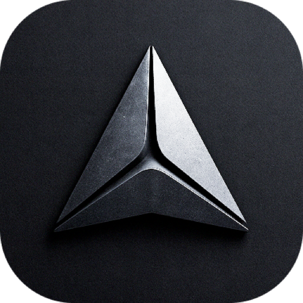

   
  
   
   
  
  # Oppla
  
  ### Know what to build. Build it right.
  
  An AI-powered integrated development environment that transforms how you build software
  
   
  
  
  
  
  
  
  
   

---

## About Oppla

Oppla is an AI-powered product development ecosystem designed to streamline your entire development workflow:

- **Spot Meaningful Opportunities**: Use AI to analyze usage data, feedback, and trends to identify high-impact growth opportunities
- **Plan with Confidence**: Get data-driven insights and prioritization to focus on work that matters
- **Build Contextually**: Generate production-ready code that's tailored to your specific workspace and strategy

### Key Features

- 🎯 **AI-Generated Opportunity Identification** - Automatically discover what features and improvements will have the most impact
- 📊 **Smart Prioritization** - Focus on high-value work with AI-driven priority scoring
- 🚀 **Contextual Code Generation** - Get code that fits perfectly into your existing codebase
- 👥 **Team Collaboration** - Built for both solo developers and teams
- ⚡ **High Performance** - Built on top of a blazing-fast editor foundation

## Attribution

Oppla is built on top of [Zed](https://github.com/zed-industries/zed), the high-performance, multiplayer code editor created by the team behind Atom and Tree-sitter. We are deeply grateful to the Zed team for creating such an excellent foundation that allows us to focus on building AI-powered development features.

This project is a fork of Zed, and we maintain full compatibility with Zed's core architecture while adding our AI-powered capabilities on top.

---

## Installation

### macOS and Linux

You can [download Oppla directly](https://oppla.ai/download) or install via your local package manager (coming soon).

### Other Platforms

- Windows (coming soon)
- Web (planned)

## Development

### Building Oppla

- [Building for macOS](./docs/src/development/macos.md)
- [Building for Linux](./docs/src/development/linux.md)
- [Building for Windows](./docs/src/development/windows.md)
- [Running Collaboration Locally](./docs/src/development/local-collaboration.md)

### Architecture Overview

Oppla inherits Zed's modular architecture and extends it with AI capabilities:

- [`gpui`](/crates/gpui) - GPU-accelerated UI framework (from Zed)
- [`editor`](/crates/editor) - Core editor functionality (from Zed)
- [`project`](/crates/project) - Project and file management (from Zed)
- [`workspace`](/crates/workspace) - Workspace management (from Zed)
- [`lsp`](/crates/lsp) - Language Server Protocol support (from Zed)
- [`collab`](/crates/collab) - Collaboration server (from Zed)
- AI modules (Oppla additions) - Intelligent code generation and opportunity identification

## Contributing

We welcome contributions! See [CONTRIBUTING.md](./CONTRIBUTING.md) for guidelines on how to contribute to Oppla.

### Development Setup

1. Clone the repository
2. Copy `.env.toml` files and configure with your settings
3. Follow the platform-specific build instructions in the docs

### Community

- [Discord Server](https://discord.gg/KZJD9WqCkS) - Join our community for real-time discussions
- [GitHub Discussions](https://github.com/Oppla-AI/oppla/discussions) - Ask questions and share ideas
- [Issue Tracker](https://github.com/Oppla-AI/oppla/issues) - Report bugs and request features
- [Website](https://oppla.ai) - Learn more about Oppla

## Licensing

Oppla maintains the same licensing structure as Zed. See the LICENSE files for details:

- [LICENSE-AGPL](./LICENSE-AGPL) - For the collaboration server
- [LICENSE-APACHE](./LICENSE-APACHE) - For core components
- [LICENSE-GPL](./LICENSE-GPL) - For copyleft components

Third-party dependencies are managed via `cargo-about`. See the [build documentation](./docs/src/development/macos.md) for details on license compliance.

## Partners

We're proud to collaborate with industry leaders including Google, Microsoft, and IBM to bring you the best AI-powered development experience.

---

**Make every build count.** Oppla gives you the clarity to spot high-impact opportunities, plan confidently, and deliver context-aware code.

Visit [oppla.ai](https://oppla.ai) to learn more.